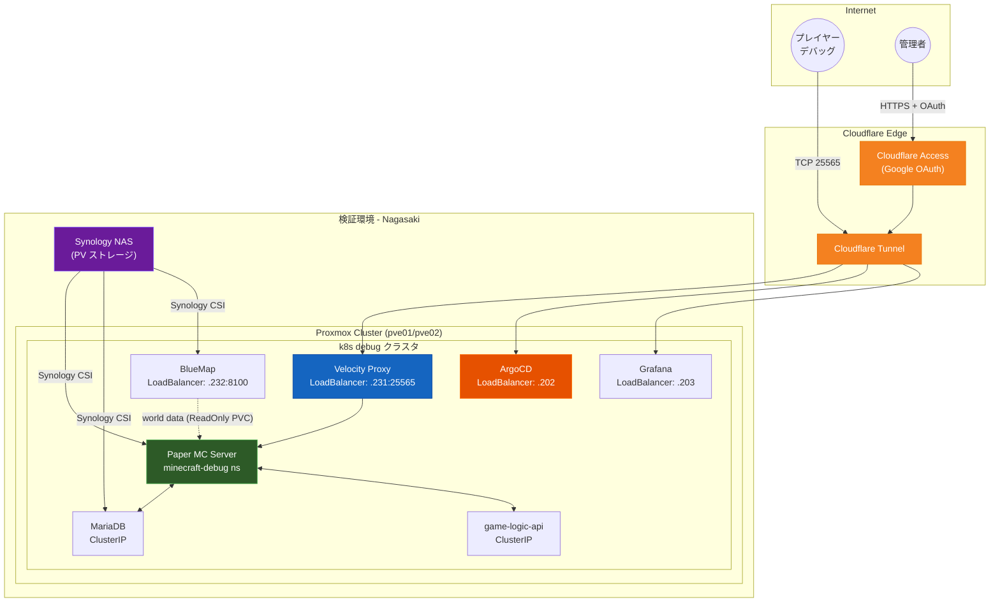
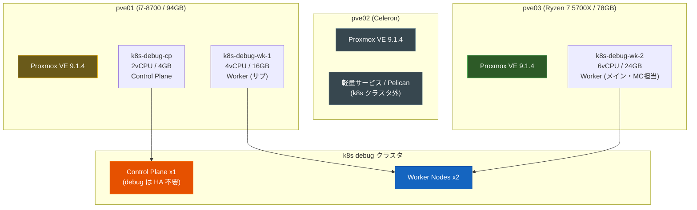
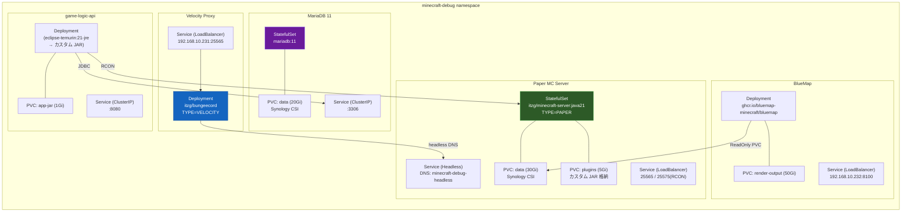
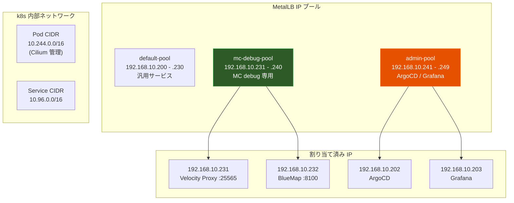
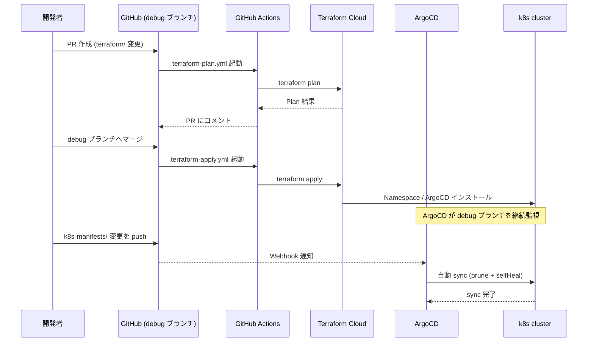
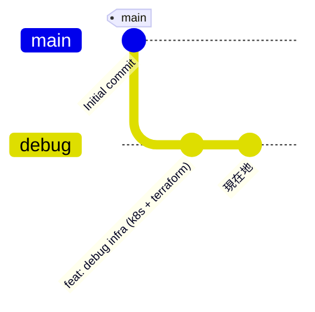

# strategy-games infra-repo

> **現在のブランチ: `debug`** — 検証環境向け GitOps リポジトリ
>
> 本番環境は `main` ブランチで管理（未実装）

## 目次

- [ブランチ概要](#ブランチ概要)
- [インフラ全体図](#インフラ全体図)
- [検証環境 k8s クラスタ構成](#検証環境-k8s-クラスタ構成)
- [debug ブランチ デプロイ構成](#debug-ブランチ-デプロイ構成)
- [ネットワーク構成](#ネットワーク構成)
- [GitOps フロー](#gitops-フロー)
- [ディレクトリ構成](#ディレクトリ構成)
- [ブランチ戦略](#ブランチ戦略)

---

## ブランチ概要

| ブランチ | 環境 | 状態 | 用途 |
|---|---|---|---|
| `debug` | 検証 (Nagasaki) | **実装済み** | デバッグプレイヤーによる動作確認 |
| `main` | 本番 (sv01/02/03) | 未実装 | 本番サービス提供 |

---

## インフラ全体図



---

## 検証環境 k8s クラスタ構成



---

## debug ブランチ デプロイ構成

### `minecraft-debug` namespace (mc-services AppProject)



### cluster-wide-apps (ArgoCD 自動管理)

| コンポーネント | Helm Chart | 用途 |
|---|---|---|
| `cilium` | helm.cilium.io | CNI (kube-proxy 置換) |
| `metallb` | metallb.github.io | LoadBalancer IP 割り当て |
| `cert-manager` | charts.jetstack.io | TLS 証明書自動発行 |
| `monitoring/prometheus` | prometheus-community | メトリクス収集 |
| `monitoring/grafana` | grafana.github.io | ダッシュボード |
| `synology-csi` | github.com/SynologyOpenSource/synology-csi | NAS 永続ボリューム |
| `velero` | vmware-tanzu | k8s リソースバックアップ |

---

## ネットワーク構成



---

## GitOps フロー



---

## ディレクトリ構成

```
infra-repo/
├── .github/
│   └── workflows/
│       ├── terraform-plan.yml    # PR 時に plan 結果をコメント
│       └── terraform-apply.yml   # debug push 時に apply
│
├── terraform/                    # IaC (Cloudflare / GitHub / k8s Bootstrap)
│   ├── versions.tf               # Provider バージョン固定
│   ├── main.tf                   # Provider 設定
│   ├── variables.tf              # 変数定義 (シークレットは Terraform Cloud)
│   ├── outputs.tf
│   ├── cloudflare_dns.tf         # DNS レコード (debug.strategy-games.net 等)
│   ├── cloudflare_tunnel.tf      # Cloudflare Tunnel ingress ルール
│   ├── cloudflare_access.tf      # Zero Trust Access (Google OAuth)
│   ├── cloudflare_firewall.tf    # WAF ルール
│   ├── github_org.tf             # チーム管理 (infra/mc-ops/moderators/debug-players)
│   ├── github_repos.tf           # リポジトリ設定 / ブランチ保護
│   ├── kubernetes_namespaces.tf  # Namespace 作成
│   ├── kubernetes_secrets.tf     # Secret bootstrap
│   └── helm_argocd.tf            # ArgoCD Helm インストール + Root Application
│
└── k8s-manifests/                # ArgoCD GitOps マニフェスト
    ├── apps/root/
    │   ├── projects.yaml         # AppProject 定義 x3
    │   └── apps.yaml             # ApplicationSet 定義 x3
    │
    ├── cluster-wide-apps/        # インフラコンポーネント (自動検出)
    │   ├── cilium/values.yaml
    │   ├── metallb/              # ip-address-pool / l2-advertisement
    │   ├── monitoring/           # prometheus / grafana
    │   ├── cert-manager/values.yaml
    │   ├── synology-csi/values.yaml
    │   └── velero/values.yaml
    │
    ├── mc-services/              # MC 関連サービス → minecraft-debug ns
    │   ├── minecraft-debug/      # Paper StatefulSet (メイン)
    │   ├── velocity-proxy/       # Velocity プロキシ
    │   ├── mariadb/              # MariaDB 11
    │   ├── bluemap/              # 3D マップレンダリング
    │   └── game-logic/           # ゲームロジック API
    │
    └── web-services/             # Web サービス (values のみ / 移行予定)
        ├── mattermost/values.yaml
        └── pelican/values.yaml
```

---

## ブランチ戦略



| ブランチ | Terraform Workspace | ArgoCD targetRevision | k8s Namespace |
|---|---|---|---|
| `debug` | `infra-debug` | `debug` | `minecraft-debug` |
| `main` | `infra-prod` (未作成) | `main` | `minecraft` |

---

## デプロイ状況 (debug ブランチ)

> 最終更新: 2026-04-02 — `argocd app list` の実測値に基づく

### インフラ基盤

| コンポーネント | ArgoCD 状態 | 備考 |
|---|---|---|
| Proxmox VM (CP/WK) | — | cloud-init snippet 方式で稼働中 |
| Cilium CNI | ✅ Synced / Healthy | kube-proxy 置換モード |
| MetalLB | ✅ Synced / Healthy | L2 モード |
| cert-manager | ✅ Synced / Healthy | |
| Synology CSI | ✅ Synced / Healthy | ArgoCD (GitOps) 管理 |
| Monitoring (Prometheus/Grafana) | ✅ Synced / Healthy | |
| Velero | ✅ Synced / Healthy | |
| ArgoCD | ✅ Terraform Helm インストール済み | |
| Cloudflare DNS/Tunnel | ✅ 作成済み | Terraform apply 完了 |
| GitHub チーム/ブランチ保護 | ✅ 設定済み | public リポジトリ必須 |
| Cloudflare WAF Ruleset | ⏸️ スキップ | 有料プラン必要 |

### MC サービス (minecraft-debug namespace)

| コンポーネント | ArgoCD 状態 | 備考 |
|---|---|---|
| mc-minecraft-debug | ✅ Synced / ⏳ Progressing | Paper 起動中 (初回 JAR DL + ワールド生成) |
| mc-mariadb | ✅ Synced / ⏳ Progressing | DB 初期化中 |
| mc-velocity-proxy | ✅ Synced / ⚠️ Degraded | MC 起動完了で自動回復予定 |
| mc-bluemap | ✅ Synced / ⚠️ Degraded | RWO PVC 別ノード問題 → nodeAffinity 要修正 |
| mc-game-logic | ✅ Synced / ⚠️ Degraded | JAR 未配置 / カスタムイメージ未ビルド |

### Web サービス

| コンポーネント | ArgoCD 状態 | 備考 |
|---|---|---|
| web-mattermost | ✅ Synced / Healthy | |
| web-pelican | ✅ Synced / Healthy | |

### 既知の制約・未解決問題

- **Cloudflare WAF Ruleset**: `http_request_firewall_custom` フェーズは Pro プラン以上が必要。`cloudflare_firewall.tf` はコメントアウト済み。
- **GitHub ブランチ保護**: Free プランでは public リポジトリのみ有効。`visibility = "public"` に設定済み。
- **Terraform Cloud 実行モード**: プライベートクラスタのため **Local モード** で実行。
- **mc-bluemap Degraded**: `minecraft-debug-data-minecraft-debug-0` は `ReadWriteOnce` PVC のため、MC Pod と異なるノードにスケジュールされると mount 失敗。`k8s-manifests/mc-services/bluemap/deployment.yaml` に MC と同じ `k8s-debug-wk-2` への `nodeAffinity` 追加が必要。
- **mc-game-logic Degraded**: placeholder image (`eclipse-temurin:21-jre-bookworm`) を使用中。CI/CD で `ghcr.io/strategy-games/game-logic-api:debug` をビルド・push するか、PVC (`game-logic-api-jar`) に JAR を手動配置するまで Degraded のまま。
